# ⚙️ Setup
We assume you are running the project on either macOS or Linux through AWS. Clone this repository using the `git clone <link-to-repo>`.

## 1.1 MacOS Setup 
Open a terminal and run the line below to install **homebrew**, a macOS package manager. You can skip this step if you already have brew installed.
```
/bin/bash -c "$(curl -fsSL https://raw.githubusercontent.com/Homebrew/install/HEAD/install.sh)"
```
If this doesn't work, visit https://docs.brew.sh/Installation for further installation options, including a .pkg installer that should be convenient and easy to use.

## 1.2 Linuxbrew for AWS
Follow the separate AWS [setup guide](./aws_instructions.md), then return here to set up linuxbrew below.
Make sure you are using a Debian or Ubuntu distribution. Then go ahead and install linuxbrew, using the instructions below:

1. Switch to root with: `sudo su -`
2. Then run: `passwd ubuntu`
3. It is going to prompt: `Enter new UNIX password:`

Set the password and exit root by typing `exit`. 

Install brew using the bash script from https://brew.sh/. You will be prompted to set the password you made earlier.
```
/bin/bash -c "$(curl -fsSL https://raw.githubusercontent.com/Homebrew/install/HEAD/install.sh)"
```

After this is complete, add brew to your execution path:
```
echo >> /home/ubuntu/.bashrc
echo 'eval "$(/home/linuxbrew/.linuxbrew/bin/brew shellenv)"' >> /home/ubuntu/.bashrc
eval "$(/home/linuxbrew/.linuxbrew/bin/brew shellenv)"
```

# 🛠️ Install Tools 

## 2.1.1 Node.js on MacOS 
Check if Node.js is downloaded by running the following command. If the following command, prints out `v20.18.0` or higher, this step can be skipped. If not, run the following command:

```
# download and install Node.js
brew install node@20
# verifies the right Node.js version is in the environment
node -v # should print `v20.18.0`
# verifies the right npm version is in the environment
npm -v # should print `10.8.2`
```
## 2.1.2 Node.js on Linux for AWS
 See https://nodejs.org/en/download/package-manager for more details. On AWS, you may need to run `sudo apt install unzip` first.
```
# Install fnm (Fast Node Manager)
curl -fsSL https://fnm.vercel.app/install | bash
# activate fnm
source ~/.bashrc
# Download and install Node.js using fsm
fnm use --install-if-missing 20
# Verify Node.js version in the environment
node -v # should print `v20.18.0`
# Verify npm version in the environment
npm -v # should print `10.8.2`
```
**Note:** if you try something and are denied due to permissions, running the command with `sudo` is often the solution, which runs the commands with root/admin privileges.

## 2.2 @jbrowse/cli for both MacOS and Linux (AWS)
Run the following command to use Node.js package manager to download the latest stable version of the jbrowse command line tool on both MacOS/Linux (AWS).
```
sudo npm install -g @jbrowse/cli
jbrowse --version # should print @jbrowse/cli/2.17.0 darwin-arm64 node-v20.18.0
```
**Note:** if the above command doesn't work, you can try `npm install -g @jbrowse/cli `.
## 2.3 System dependencies
Install the following tools, if not already installed:
### MacOS
```
brew install wget httpd samtools htslib minimap2
```
### Linux (AWS)
```
sudo apt install wget apache2
brew install samtools htslib minimap2
```
# 🌐 Start the Server
## 3.1 Start the apache server
Starting up the web server will provide a localhost page to show that apache2 is installed and working correctly. 
### MacOS
```
sudo brew services start httpd
```

if you receive the error message: "httpd must be run as non-root to start at user login!" Retry without Sudo-ing in
```
brew services start httpd
```

### Linux (AWS)
AWS will have a public IP address that you need to identify in the aws_instructions.
```
sudo service apache2 start
```
## 3.2 Get the host
### MacOS
The hostname is `localhost`
### Linux (AWS)
In your instance summary page, there should be an "auto-assigned IP address." Your web server can be accessed at `http://ipaddress`. You don't need to provide a port.

Open a browser and type the appropriate url into the address bar. You should then get to a page that says **"It works!"** (for AWS there may be some additional info). If you have trouble accessing the server, you can try checking your firewall settings and disabling any VPNs or proxies to make sure traffic to localhost is allowed.

## 3.3 Apache server folder
### MacOS
Installation on MacOS using brew, the apache2 server holder is likely in `/opt/homebrew/var/www` (for M1) or `/usr/local/var/www` (for Intel).
### Linux (AWS)
For a normal linux installation, the folder should be `/var/www` or `/var/www/html`.

You can run `brew --prefix` to get the brew install location, and then from there, it is in the `var/www` folder. Make sure that one of these folders exists and take note of what the folder is. Run the command below to store it as a command-line variable. You will need to re-run the export if you restart your terminal session!
```
# Replace the path with your actual true path!
export APACHE_ROOT='/path/to/rootdir'
```

## 3.4 Download JBrowse2 into Apache2
Download and copy over JBrowse 2 into the apache2 root dir, setting the owner to the current user with `chown` and printing out the version number. This version doesn't have to match the command-line jbrowse version, but it should be a version that makes sense.
```
jbrowse create output_folder
sudo mv output_folder $APACHE_ROOT/jbrowse2
sudo chown -R $(whoami) $APACHE_ROOT/jbrowse2
```
In your browser, now type in   `http://yourhost/jbrowse2/`, where `yourhost` is either localhost or the IP address from earlier. Now you should see the words **"It worked!"** with a green box underneath saying "JBrowse 2 is installed." with some additional details.

# 📊 Load and Process Data
Within the `jbrowse2_project` directory, run the following script to fetch and process the data on both MacOS and Linux (AWS):
```
bash fetch_and_process_data.sh
```

# 🌍 Access Virus Data via Accession Numbers

This table provides the accession numbers for various virus datasets. If the provided links fail, you can use these accession numbers to retrieve the data directly from the [UniProt database](https://www.uniprot.org).

| **Virus Label**       | **Accession Number** |
|------------------------|----------------------|
| HIV1 M B gag pol       | P12497              |
| HIV1 M C gag pol       | O12158              |
| HIV2 A gag pol         | P12451              |
| HIV2 B gag pol         | P15833              |
| SIV cpz gag pol        | Q1A267              |
| HIV1 M B env           | P12490              |
| HIV1 M C env           | O12164              |
| HIV2 A env             | P12449              |
| HIV2 B env             | P15831              |
| SIV cpz env            | Q1A261              |

Feel free to use these accession numbers to manually search and access genomic and protein data from trusted resources. 🔗

# 🧬 Launch the JBrowse Instance
Open `http://yourhost/jbrowse2/` again in your web browser and use the database tool to conduct explorations on Lentivirus genomic and functional protein data.

# 🧰 Using the Tool
## 🔍 6.1 Gene Search and Annotations
1. After instantiating  the JBrowse instance locally, you should have the following view:

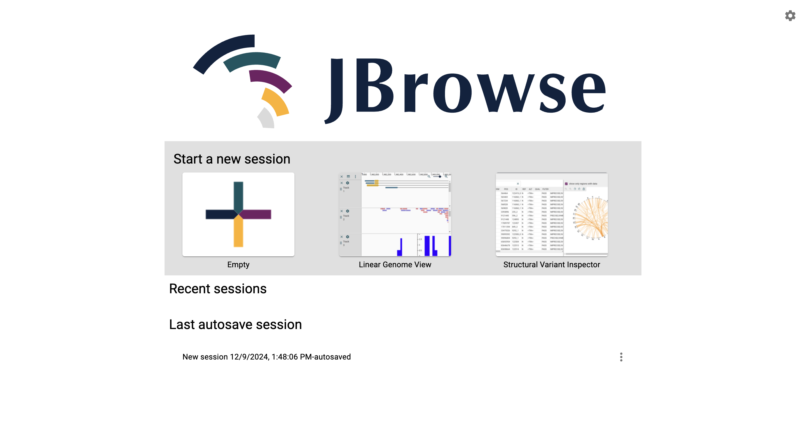

2. Here, click on `Linear Genome View`, to open the JBrowse instance.
3. Under the assembly dropdown, you can select the `Reference Genomes` for HIV-1, HIV-2, and SIV to visualize the genomic data with annotations.


4. After selecting the reference genome, click `Open` to visualize the genome. 
5. Click `Open Track Selector` to select the Annotated Genome data for the selected HIV Genome assembly.
6. Selec the `<HIV-Type>-Annotations` track to visualize the annotated selected HIV type

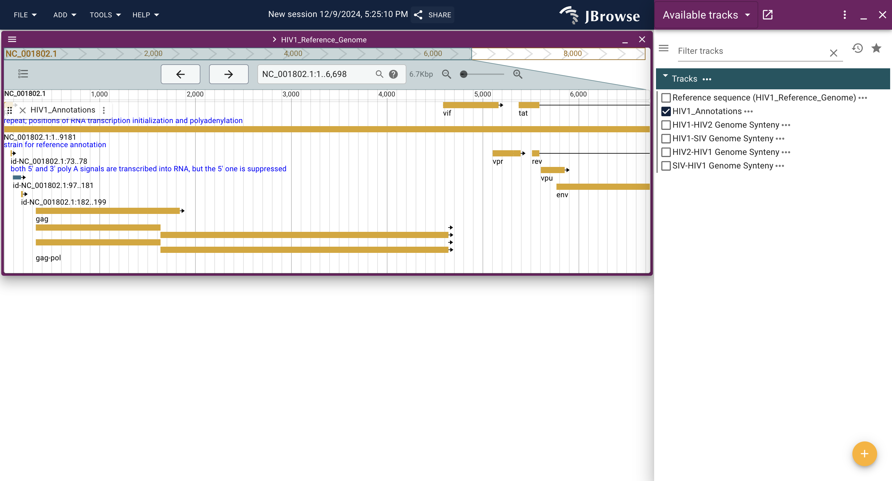

7. You can search for a specific gene of interest in on the search bar. For example, for the `gag` gene in HIV-1, you can search `gag` and look at its features, as shown below.

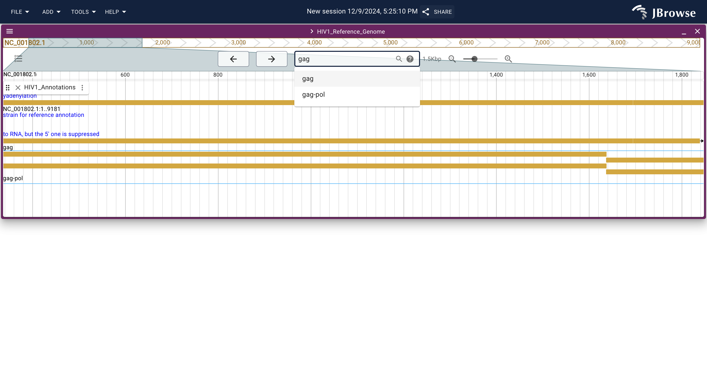
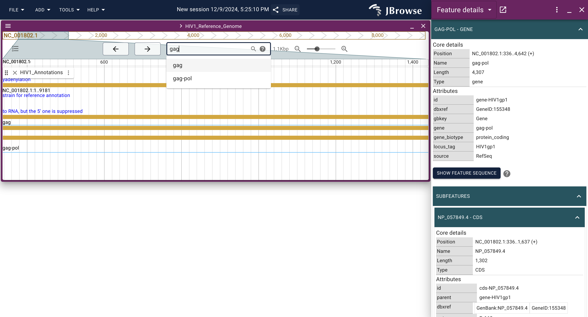


## 🧬 6.2 Linear Synteny View
Follow the instructions below to visualize the linear synteny view among selected reference genomes.

1. Under the `Select a view to launch`, choose `Linear Synteny View` and click `Launch View`.

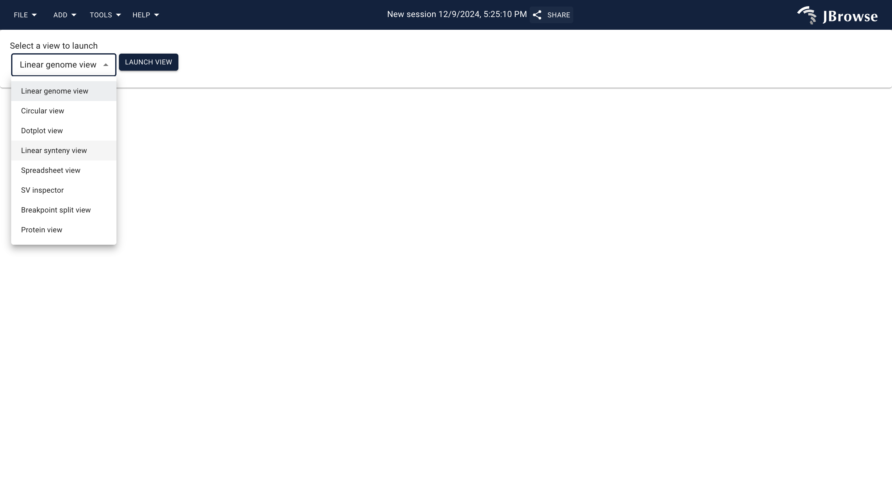

2. Select two reference genomes of interest (`HIV1_Reference_Genome`, `HIV2_Reference_Genome`, `SIV_Reference_Genome`). 
3. On the right, select the Synteny track from existing tracks. **Note that the order of the Reference Genomes and the Synteny track should match. For example, if you select `HIV1_Reference_Genome` as Row 1 and `HIV2_Reference_Genome` as Row 2, the synteny track should be `HIV1-HIV2 Genome Synteny` and not the other way around.**
4. Click `Launch`.
5. Click `Open Track Selector` for both genomes and select the appropriate `Annotation Tracks` as per above. 

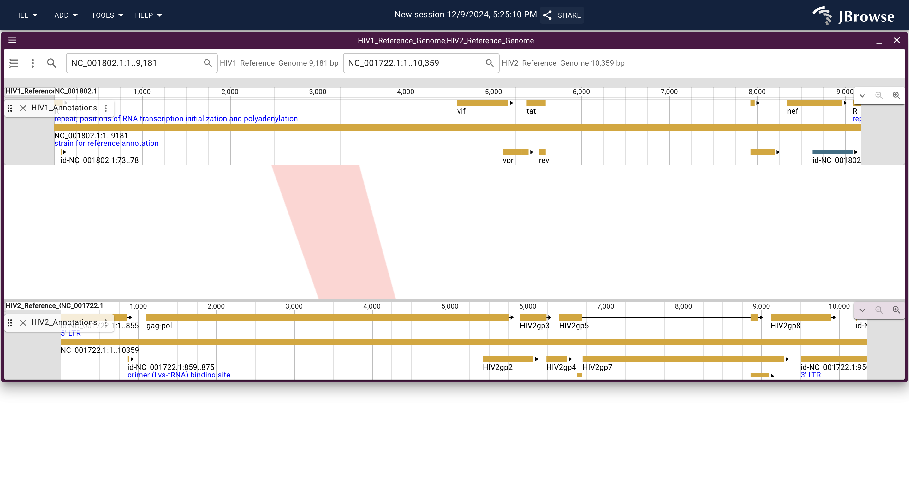

Inspect and analyze `conversed regions` among the two genomes using the Synteny View.


## 🪢 6.3 Protein Structures
Follow the instructions below to visualize selected proteins of interest to study their molecular structures and functional domains.
1. From the JBrowse instance, go to `Tools` (on the top menu), then `Plugin Store`. 

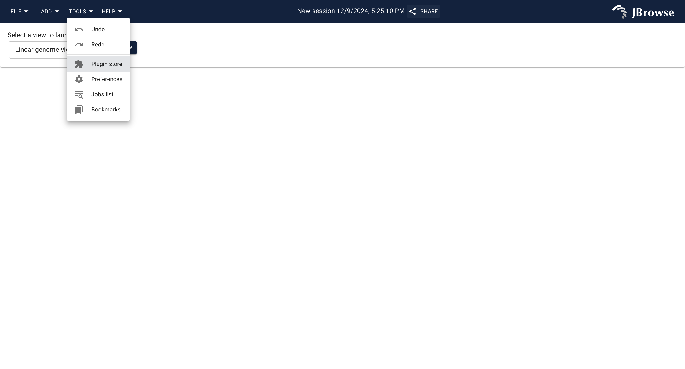

2. Locate the `Protein3d` plugin (at the very end) and install it.

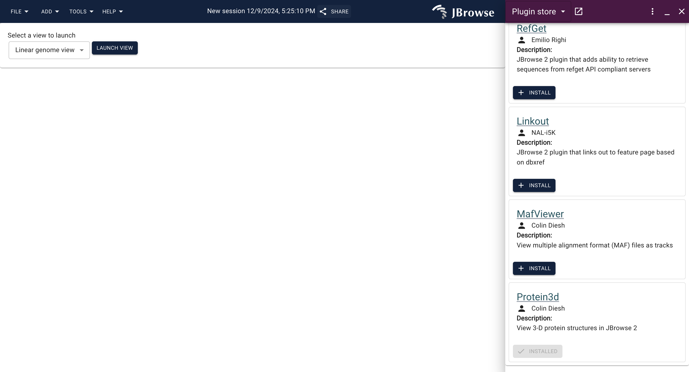


3. Under the `Select a view to launch`, choose `Protein view` and click `Launch View`.

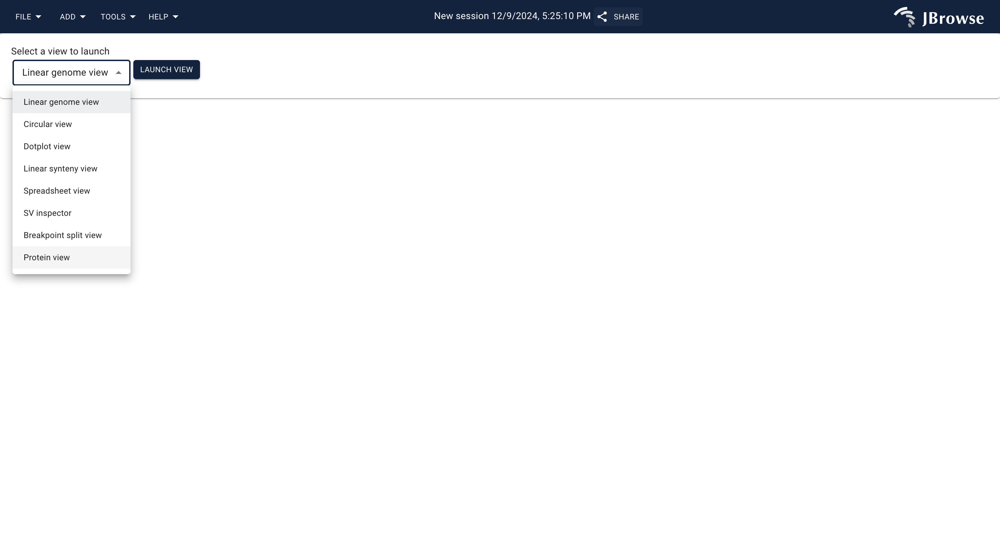

4. Once the protein view is launched, locate the wrench `🔧` icon to the right of the screen and click it.
5. Locate the `PDB ID(s)` section on the left, and enter the PDB ID of the selected protein of interest. We provide **Table 1-4** below which gives a comprehensive list of IDs of proteins we focus on.

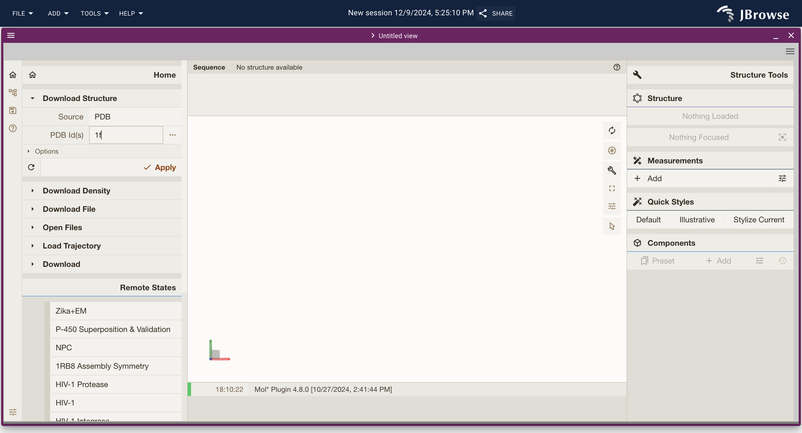

6. Once you enter the `PDB ID`, click `Apply`. Once loaded, click on `Assembly1` and then `Apply Action`. From there, click on `3D Representation` 

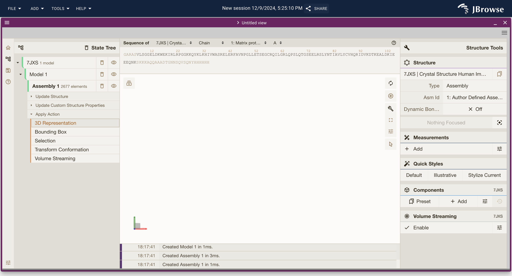

7. Click `Apply` and wait for the 3D structure to load. 

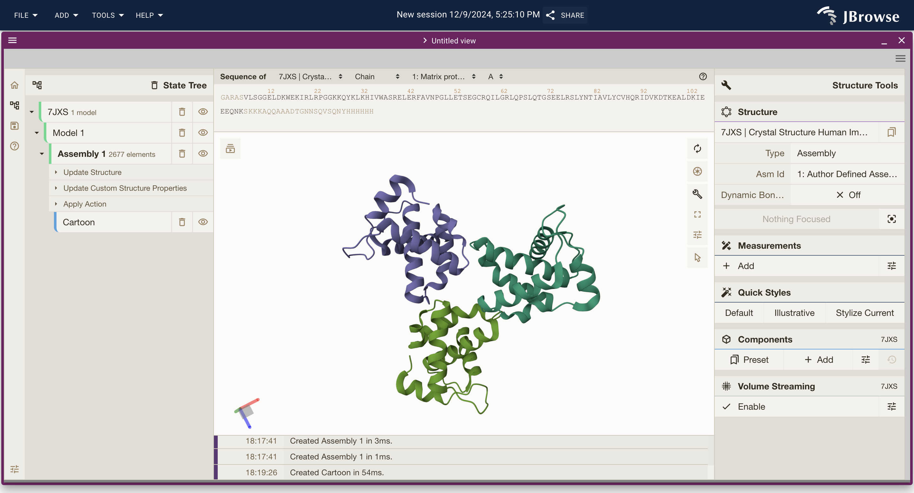

8. You can rotate and inspect the 3D structure and click on regions to explore specific molecular bonds and interactions. Hovering the mouse over the structure, you can inspect different domains of the protein.

# Tables 1-4: Tables of PDB IDs of Proteins of Interest
### Table 1: Table of PDB IDs for Protein Domains of the Gag protein

| Virus Type | PDB | Domain |  Description |
|:-----------:|:-------:|:---------:|:-------------|
| HIV-1       | 1HIW    | Matrix | Crystal structures of the trimeric human immunodeficiency virus type 1 matrix protein|
| HIV-1 Q63R Mutant       | 7JXR   |Matrix| Crystal Structure Human Immunodeficiency Virus-1 Matrix Protein Mutant Q63R Crystal Form 1 |
| HIV-1 C198S Mutant | 4M0I | Capsid | Crystal Structure of Synthetic HIV-1 Capsid C-Terminal Domain (CTD) |
| SIV         | 4HTW   | Capsid | SIVmac239 Capsid N-Terminal Domain|
| HIV-2       | 2E1X   | Nucleocapsid |  NMR Structure of the HIV-2 Nucleocapsid Protein
| HIV-2       | 2EC7 | Nucleocapsid  | Solution Structure of Human Immunodeficiency Virus Type-2 Nucleocapsid Protein |

### Table 2: Table of PDB IDs for Envelope Glycoprotein gp120

| Virus Type | PDB |  Description |
|:------------:|:------:|:-------------|
| HIV-1 Subtype C       | 3TIH   | Crystal Structure of Unliganded HIV-1 Clade C Strain ZM109F.PB4 gp120 Core |
| HIV-2       | 5CAY   | Envelope Glycoprotein gp120 Core from HIV Type 2 Bound to the First Two Domains of Human Soluble CD4 Receptor |
| SIV         | 2BF1   | Structure of an Unliganded and Fully-Glycosylated SIV gp120 Envelope Glycoprotein |

### Table 3: Table of PDB IDs for Reverse Transcriptase
| Virus Type | PDB |  Description |
|:------------:|:------:|:-------------|
| HIV-1       | 1HMV   | The Structure of Unliganded Reverse Transcriptase from the Human Immunodeficiency Virus Type 1 |
| HIV-2       | 1MU2   | Crystal Structure of HIV-2 Reverse Transcriptase                          |

### Table 4: Table of PDB IDs for Tat Protein
| Virus Type | PDB |  Description |
|:------------:|:------:|:-------------|
| HIV-1       | 7T1P   | Solution Structure of 7SK Stem-Loop 1 with HIV-1 Tat Finland Arginine Rich Motif |
| HIV-1       | 3MIA   | Crystal Structure of HIV-1 Tat Complexed with ATP-Bound Human P-TEFb       |
| HIV-1       | 1JFW   | Homonuclear and Heteronuclear 1H-13C Nuclear Magnetic Resonance Assignment and Structural Characterization of a HIV-1 Tat Protein |

## ⁑ 6.4 Multiple Sequence Alignment
We used <a href="https://www.ebi.ac.uk/jdispatcher/msa">Clustal Omega</a> to conduct Multiple Sequence Alignments for our target proteins (nammely Gag-pol, Env, and Tat proteins) among HIV-1 Subtypes C and B; HIV-2 Subtypes A and B; SIVcpz isolate MB66. Here, we display the resulting alignment heat maps for each protien of target.

### Figure 1: Alignment Heatmap for Gag-pol Polyprotein
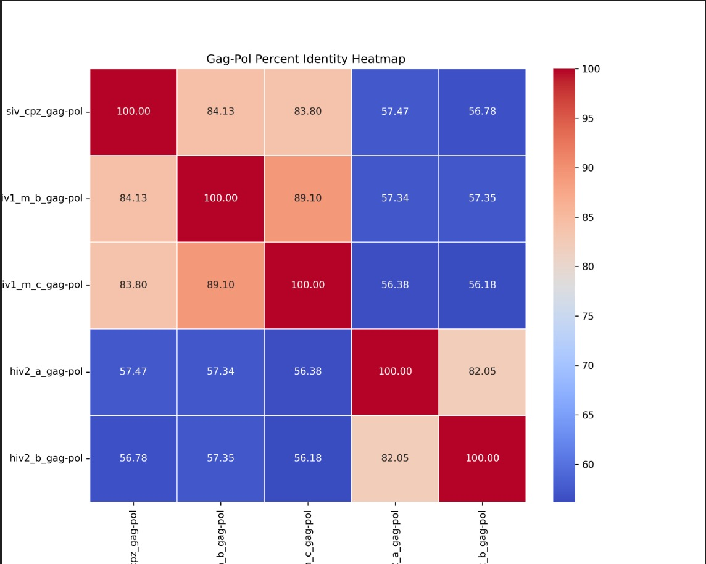

### Figure 2: Alignment Heatmap for Env Protein
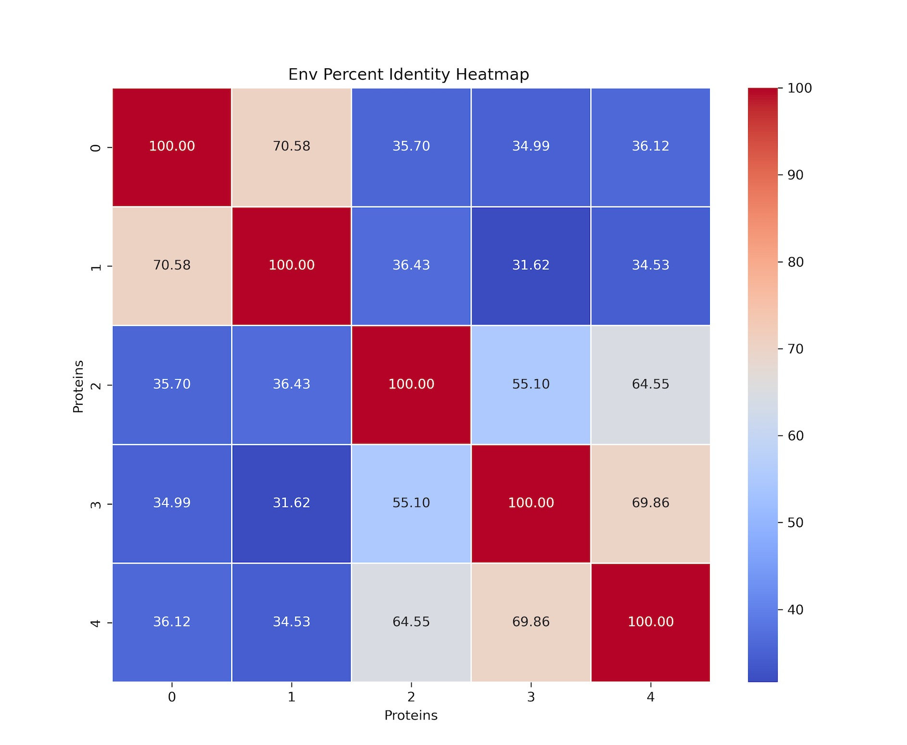

### Figure 3: Alignment Heatmap for Tat Protein
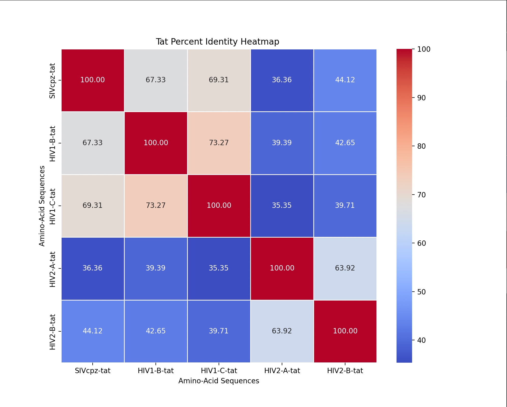
